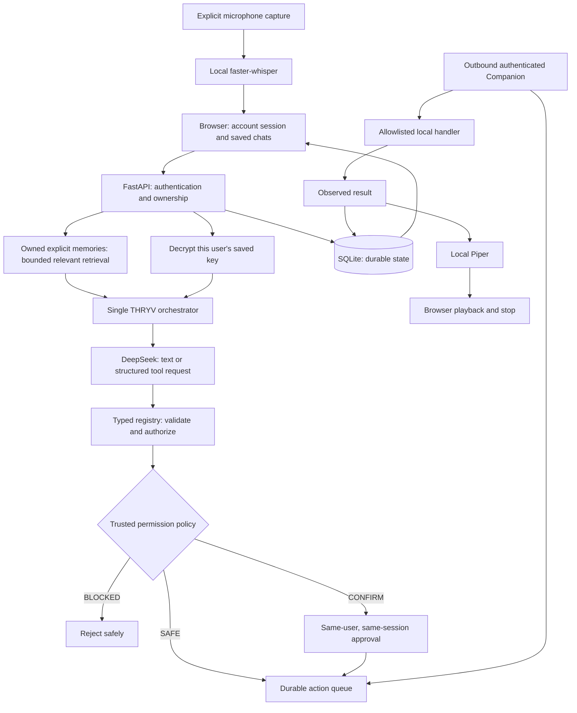

# THRYV

**Your Personal AI** · Created by Omkar Zunje

THRYV is a personal AI workspace for thinking, writing, learning, and taking small, authorized actions on your own computer. Creator attribution never implies the current user's identity. Engineering uses **GPT-6 Astra only**; DeepSeek is the runtime provider.

## V2 — Voice and personal memory

V2 extends the working V1 accounts, owned chats, encrypted BYOK, and scoped Linux Companion.
You can talk to THRYV, hear replies, and explicitly save useful preferences, facts, projects,
and decisions across sessions. Text and speech share one warm, conversational personality;
technical answers, confirmations, errors, and device results remain clear and truthful.

See [V2 architecture and setup](docs/v2.md) and [verification](docs/verification.md) for
acceptance evidence and limits. The historical [V1 report](docs/verification-v1.md) retains
the real DeepSeek → confirmed Chrome launch gate. V3 browser/research work starts only after V2 is committed and pushed.



## Run locally

Prerequisites: Python 3.12+, uv, Node.js 24, npm. Ordinary tests use fake provider responses and mock desktop effects. A real conversation requires your own DeepSeek key with API credit.

From the repository root:

```bash
cd backend
uv sync --locked
uv run python scripts/init_local.py
uv run alembic upgrade head
uv run uvicorn app.main:app --host 127.0.0.1 --port 8000 --reload --no-access-log
```

The initialization helper creates an ignored `.env` and a persistent Fernet encryption key, without printing it. Keep that key separate from database backups. Do not replace it casually: existing saved provider keys would become unreadable.

In another terminal:

```bash
cd frontend
cp .env.example .env.local
npm ci
npm run dev
```

Open **http://localhost:3000**, create an account (12–128 character password), then connect DeepSeek. Check the explicit consent box to save the key encrypted on this server. Refresh preserves the account session, selected/recent conversation, messages, and provider connection. The URL fragment may contain an opaque conversation ID; it contains no credential or message. A new conversation keeps the old one. Replacing/removing a provider key keeps chats. Sign out invalidates that browser session; signing back in restores your data.

Backend and frontend hostnames must match the configured origin exactly. `localhost` and `127.0.0.1` are different origins; do not mix them.

## Use voice and personal memory

From `backend/`, install local speech and download its models once:

```bash
uv sync --locked --extra voice
uv run --extra voice python scripts/setup_voice.py
uv run --extra voice uvicorn app.main:app --host 127.0.0.1 --port 8000 --no-access-log
```

Select **Talk**, grant microphone access, speak, then pause for about 1.3 seconds to send automatically. **Finish & send** remains a fallback. Recording
stops after 30 seconds. Speech runs on your THRYV backend host; only the transcript enters
the existing chat/orchestrator. **Stop voice** releases capture or stops playback.
**Speak voice replies** controls automatic reading, and **Read reply** reads the latest reply.
A connected Companion is needed for computer tools; voice never grants approval.
**Settings → Voice → Wake word (Beta)** enables the one fixed keyword **THRYV**.
It defaults Off and may miss invocations or mis-detect similar-sounding words. Talk is the
recommended reliable fallback. Wake-triggered tools still follow SAFE/CONFIRM/BLOCKED permissions.
“Hey Thryv, open Chrome” retains the command in the same utterance and still requires approval.

Say or type **“Remember that I prefer Python projects to use uv.”** Then start another
conversation and ask **“What Python package workflow do I prefer?”** The **Memory** panel
supports adding, viewing, deleting, clearing, and disabling memories. Ordinary chats do not
become memories automatically. Bare “remember this” asks you to provide the fact explicitly.

Speech currently supports English, reads up to 600 characters, and requires HTTPS or localhost
microphone access. Missing models or denied microphone access leave text chat available.
Audio is held in memory, not saved. Transcripts are ordinary saved chat messages. See
[model setup, licensing, privacy and limits](docs/v2.md).

## Pair your Linux computer

Run Companion as your regular desktop user, in a terminal inside the graphical session. It opens no listening ports. Chrome and VS Code must be installed in the supported trusted system locations.

1. In THRYV, open **Devices & Actions → Add device**.
2. On the computer being paired, run from the checkout:

   ```bash
   uv sync --project companion --locked
   uv run --project companion thryv-companion pair --server http://localhost:8000 --name "My laptop"
   ```

3. Copy the hidden pairing token from the browser and paste into the Companion's hidden terminal prompt. It expires after five minutes and works once. Never put it in a command argument, URL, screenshot, or chat.
4. Start the outbound polling loop:

   ```bash
   uv run --project companion thryv-companion run
   ```

5. Select your online device, ask **“Open Chrome on my laptop.”**, and review **Allow action**. THRYV reports success only after Companion observes a new matching window. Review **Recent Actions**; **Revoke** invalidates the credential and cancels pending work.

For a remote backend use its HTTPS origin. HTTP is accepted only on loopback. Companion credentials live in `~/.local/share/thryv-companion/device.json` (0600) inside a 0700 directory. `--state-dir` supports separate pairings. Revoke the old device before pairing with a new state directory. Stop with Ctrl+C; there is no installer, auto-start service, or auto-updater.

| Tool | Permission | Execution |
| --- | --- | --- |
| `open_application` | CONFIRM | `application` must be `chrome` or `vscode`; fixed executable/arguments; no shell |
| `get_system_info` | SAFE | Only OS and CPU architecture enums; no hostname, files, processes, or environment |
| Anything else | BLOCKED | Rejected; never dispatched |

Chrome uses a dedicated local profile at `~/.local/share/thryv-companion/chrome-profile` and opens `about:blank`. This permits X11/XWayland window verification even when your usual Chrome instance runs on Wayland. It does not use your existing signed-in browser profile. VS Code uses a new window; if it cannot be verified, THRYV reports an unconfirmed result. Windows/macOS application launching is not implemented.

## State, privacy, and authentication

- FastAPI Users handles registration/password verification using Argon2. Independent random database-backed sessions expire after seven days. Cookies are HttpOnly, SameSite=Lax, Secure in production, and host-only. Only SHA-256 digests of high-entropy session/device/pairing tokens persist server-side.
- Each resource query checks the authenticated account or paired device's ownership. API keys never identify accounts. Browser mutations require exact `Origin` and `X-THRYV-Request: 1`; CORS allows one configured frontend and credentialed requests.
- Provider keys are saved only with explicit consent, using authenticated Fernet encryption and owner binding under a server-held key. The host must be trusted: it decrypts the key to call DeepSeek. Saved keys are never sent back to the frontend or to Companion.
- Conversations are durable database records, **not application-encrypted**. Protect disk volumes/backups and host access. The UI loads 100 recent turns per chat; generation uses at most 10 complete recent turns within 32,000 characters. Lists are bounded; no full-text search or export UI.
- One structured action per model turn. Confirmations expire after 120 seconds, are bound to the initiating session/user/action, and are consumed once. Dispatch/result windows are 30 seconds. A database claim and local durable execution ledger prevent automatic replay. Uncertain outcomes are never automatically re-executed.
- Audit records keep user/device/tool/validated arguments/permission/status/timestamps and sanitized results. They survive conversation deletion. This is a high-level record per action, not a tamper-proof event archive.
- Logs contain controlled status/error codes, duration, and random request IDs. No keys, passwords, message text, token headers, raw exceptions, or provider error bodies. Markdown rejects active HTML, tracking images, and unsafe link schemes.

Read the [security review and threat boundaries](docs/security.md) before hosting for other people.

## Configuration

| Backend setting | Default / meaning |
| --- | --- |
| `APP_ENV` | `development`; production requires HTTPS frontend origin and valid encryption key |
| `FRONTEND_ORIGIN` | `http://localhost:3000`, one explicit origin without trailing slash |
| `DATABASE_URL` | `sqlite+aiosqlite:///./thryv.db`; durable single-host SQLite |
| `CREDENTIAL_ENCRYPTION_KEY` | No default; generate locally or inject from host secret storage |
| `SESSION_LIFETIME_SECONDS` | 604800 (seven days) |
| `AUTH_ATTEMPTS_PER_MINUTE` | 20 per direct client IP/process across login/register/pairing |
| `DEEPSEEK_MODEL` | `deepseek-flash`; connection verification checks model availability |
| `PROVIDER_TIMEOUT_SECONDS` | 60; browser waits up to 70 seconds |
| `MAX_CONCURRENT_REQUESTS` | 20 per process |
| `LOG_LEVEL` | INFO; controlled metadata |
| `STT_MODEL_PATH` | `.models/whisper-base.en`; optional local English recognizer |
| `WAKE_MODEL_PATH` | `.models/whisper-small.en`; optional local invocation recognizer |
| `TTS_MODEL_PATH` | `.models/en_US-lessac-medium.onnx`; optional local voice plus adjacent JSON |

Frontend `NEXT_PUBLIC_API_URL` defaults to `http://localhost:8000`, and is compiled at build time. **Never place any credential in a `NEXT_PUBLIC_*` variable.** `DEEPSEEK_API_KEY` in ignored backend `.env` or repository-root `.env` is only for the opt-in local acceptance script; production runtime never uses a developer key.

The default provider uses non-thinking, non-streaming DeepSeek chat completions with structured function tools on account-owned chat routes. See the [DeepSeek API reference](https://api-docs.deepseek.com/api/create-chat-completion/).

## API and compatibility

`/api/auth/register`, `/login`, `/logout` establish account identity. `/api/account/provider`, `/api/conversations`, `/api/devices`, and `/api/actions` are owned account APIs. Device-only `/api/companion/pair`, `/poll`, and `/actions/{id}/authorize|result` support pairing and scoped execution. Development OpenAPI is at `/docs`; production disables it. See [API details](docs/api-v1.md).

V0's `/api/provider/connect` and `/api/chat` remain stateless, request-only bearer-BYOK endpoints. They cannot access saved state or execute tools. Existing V0 clients keep working; the current browser uses account-owned endpoints. V0's visual/chat/security test scenarios remain, with reload/disconnect assertions updated for the explicitly requested persistence behavior.

## Checks and deployment

```bash
cd backend
uv run --extra voice ruff check app tests migrations scripts
uv run --extra voice ruff format --check app tests migrations scripts
uv run --extra voice pytest -q
uv run --extra voice alembic check
uv run --extra voice pip-audit
```

```bash
cd companion
uv run ruff check .
uv run ruff format --check .
uv run pytest -q
uv run pip-audit
```

```bash
cd frontend
npm run lint
npm run typecheck
npm run build
npm audit --audit-level=moderate
npx playwright install chromium
npm test
```

[Deployment preparation](docs/deployment.md) describes the persistent volume, migrations, HTTPS/site layout, backups, and limits. Public deployment still requires an explicit user instruction. V2 has no custom wake words, general browser/research automation, email, scheduling, or unrestricted terminal.
